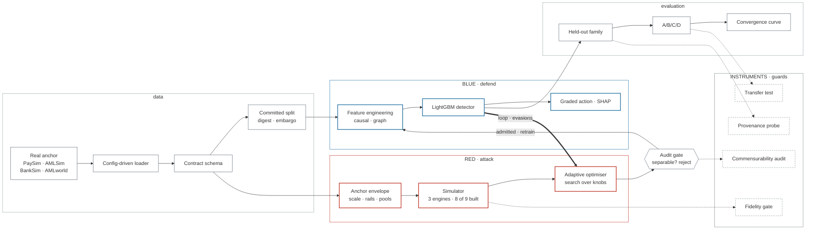

# Adaptive Fraud Simulation Lab

A closed-loop red-team / blue-team system for payment fraud. An attack simulator generates
adaptive fraud, a detector scores it, and the attacks that slip through get fed back, making the
attacker harder and the detector smarter each round.

Built for the Mastercard Innovation Challenge (GFF 2026). What the system is:

> A closed-loop adaptive fraud simulator that searches for detector blind spots while auditing
> whether its own synthetic attacks are realistic enough to support valid training and evaluation —
> and that gates its own results, withholding any apparent gain the provenance probe explains.

Generating adaptive attacks is not the hard part. Knowing whether the numbers they produce mean
anything is, and most of this repository is the instrument that answers that — including in the
cases where the answer disqualifies our own result.

Four questions decide whether this worked, each gating the next:

| | question | answer |
|---|---|---|
| 1 | Can the attacker find evasions? | **Demonstrated** — 83.6% of generated fraud past the detector in round 0, before the detector adapts |
| 2 | Can the detector close known gaps? | **Partially** — evasion falls 0.836 → 0.054 on all 7 seeds, but that is aggregate rather than per vector, and every extra layer built to close a gap was benched |
| 3 | Do the attacks pass the fidelity and provenance gates? | **On one anchor of four** — 4 of 18 leave-one-attack-out folds carry a quotable number |
| 4 | When they do, does adaptive beat non-adaptive? | **No — it underperforms.** D > C on 1/7 seeds (p = 0.992); C > D on 6/7 (p = 0.062, directional). And unconstrained: the leash vetoed 0/42 |

**We do not claim that adaptive augmentation improves recall on a held-out family.** An earlier
version of this README did; our own 7-seed test does not support it, and the one place a large gain
appeared, a model trained only on which generator wrote the row reproduced it. `docs/submission.md`
is the write-up; `docs/claim.md` states what we claim and what we do not, with every number traced
to the artefact that produced it.

The full design, the nine attack vectors, and the reasoning behind each choice live in the
architecture doc (`docs/architecture.html`). Read that for intent; this README is for running the
thing.

## How it fits together



The contract schema is the seam: both sides code against one internal type, so nothing downstream
knows or cares which anchor the rows came from, and `afl/attack/**` and `afl/defend/**` never import
each other. The bold edge is the loop — the detector's evasions steer the optimiser's next search,
the detector retrains on what the gate admitted, and the round repeats. The dashed instruments are what
make the whole thing answerable: they gate a batch before it is ever trained on, and verify a fold
before a number from it is allowed to be quoted, which is why several numbers in this README are
reported as withheld rather than reported as wins.


## Where this is right now

The pipeline runs end to end on real data. Four public anchors have been tried; the loop was run to
convergence on three of them — BankSim stopped at a three-gate spike that returned NO-GO before the
loop was ever pointed at it (`docs/adr/0004-banksim-spike-and-the-null-result.md`) — and **no anchor
validates the adaptive claim**. What is built and committed:

- **Attack side** — 9 vectors identified, 8 fully simulated; M1 is an adversarial boundary-probing extension in template mode. The multi-vector adaptive optimiser runs closed-loop with an audit
  gate in front of the detector.
- **Defence side** — 56 causal features, a tuned LightGBM detector, graded cost-based actions with
  SHAP reason codes, and an anomaly layer that did not earn its place.
- **Instruments** — commensurability audit, provenance probe, transfer test, 3-level fidelity
  scorecard, leave-one-attack-out harness. These are what most of the results are about.
- **Benched, with the evidence published** — the sequence model and the temporal GNN both lost to
  what already ships, so **the hand-rolled graph features are what ship**. Both stay
  `enabled: false`, and a test refuses to let either be switched on while the committed evidence
  says no. `artifacts/gnn/`, `artifacts/sequence/`, written up in `docs/gnn.md`,
  `docs/sequence.md` and `docs/negative-results.md`.
- **Reproducibility** — one command from a clean clone, with nothing to download: the documents
  are checked against the artefacts they cite, and the loop is run twice and compared against a
  committed expectation. Every artefact records the commit, the seed and the library versions that
  produced it. `make reproduce`, written up in `docs/reproducibility.md`.
- **Working prototype** — five acts over the committed artefacts, with the generate-and-audit step
  and the detector running live in-process. Every screen renders from a committed artefact even
  with the live path dead, and replayed data is badged rather than shown as live.
  `streamlit run prototype/app.py`, written up in `prototype/README.md`.

Out of the box a fresh clone runs on a synthetic placeholder with nothing to download, and anything
a synthetic run prints is stamped as a pipeline check.

## Quickstart

Needs Python 3.11. **On macOS, install libomp first** — the LightGBM wheel imports cleanly without
it and then fails to load its own shared library at fit time, so the code silently falls back to
sklearn. Every run records which backend produced it.

```bash
brew install libomp            # macOS only
python3.11 -m venv .venv
source .venv/bin/activate
pip install -e '.[dev]'        # or: uv sync --extra dev

make smoke                     # runs the whole loop on dummy data; has to pass
make reproduce                 # the one command: documents vs artefacts and guardrails, loop twice
make guardrails                # the wording alone, against the seven honesty guardrails
make loop                      # the adaptive loop on the synthetic default, no download

streamlit run prototype/app.py # the working prototype, five acts, no download
```

`make reproduce` is the one to run first on a fresh clone. It needs nothing downloaded, takes
about eighty seconds, and either everything checks out or it tells you which number moved:
every figure quoted in these documents is recomputed from the artefact it names, every sentence
around those figures is checked against the seven honesty guardrails, then the whole loop is run
twice on the synthetic default and both runs are compared against a committed expectation and
against each other. `docs/reproducibility.md` says what that does and does not prove.

`make sequence` and `make gnn` are the only targets needing more (torch, via `make setup-deep`).
Nothing else imports them and the default suite stays green without either.

## Reproducing the main experiment

**Without the anchor**, which is every fresh clone: `make reproduce` re-derives every number in
this README from `artifacts/abcd/` and checks the documents still quote it, then runs the loop
end to end twice on the synthetic default. It is the reproducibility claim that a reader can
check in eighty seconds without downloading anything.

**With the anchor.** The headline experiment is the A/B/C/D comparison on AMLworld, holding out
the GATHER-SCATTER laundering typology entirely. It needs the anchor in `data/raw/` (see
`docs/data.md`).

```bash
make splits                                        # commit the out-of-time boundary + digest
python scripts/abcd_experiment.py --data amlworld \
    --typology GATHER-SCATTER --seeds 7 11 23 42 101 1337 2024
make figures                                       # convergence curve, from logs only

python scripts/reproduce.py --anchor amlworld --anchor-seed 7   # re-run one seed and diff it
```

The last line is the strong form: it re-runs a seed of the committed experiment and reports every
system whose number moved. Without the anchor on disk it says which file is missing and skips,
rather than passing quietly.

Everything is config-driven with Hydra, so runs compose with overrides:

```bash
python scripts/run_experiment.py experiment=adaptive data=paysim
```

Every target is listed with a one-line comment in the `Makefile`. Results regenerate from committed artefacts — `make figures` reads
`artifacts/abcd/` and runs no model, and produces byte-identical output from the same logs.

## Main result

The **A/B/C/D experiment** (ticket 12) — four systems plus a no-model floor on the same held-out
real laundering typology. AMLworld, 7 seeds, 173 positives, base
rate 0.053%, split digest `f5e33a878d68b792`. From `artifacts/abcd/amlworld_gather-scatter.json`.

```
system         PR-AUC (mean ± sd)   recall@1%FPR     D beats it, per seed
                                                     PR-AUC          recall
A_real         0.0806 ± 0.0765      0.440 ± 0.185    1/7 p = 0.992   2/7 p = 0.938
B_smote        0.0274 ± 0.0154      0.520 ± 0.148    4/7 p = 0.500   2/7 p = 0.938
C_template     0.0557 ± 0.0560      0.544 ± 0.255    1/7 p = 0.992   2/7 p = 0.938
D_adaptive     0.0168 ± 0.0131      0.378 ± 0.292    --              --
amount_floor   0.0013               0.012            7/7 p = 0.008   6/7 p = 0.062
```

**Adaptive does not beat non-adaptive — it loses to it.** D > C on 1/7 seeds by PR-AUC
(p = 0.992) and 2/7 by recall; read the other way, **C beats D on 6/7 by PR-AUC (p = 0.062)**. That
is directional rather than significant: 6/7 does not clear 0.05, and every standard deviation here
is comparable to or larger than its own mean, so the fold is underpowered for an effect this size.
What is significant is that every system beats the no-model amount floor on PR-AUC, 7/7, p = 0.008 —
which says the fold is not measuring amount-legibility, and nothing about adaptive.

**This is unconstrained adaptive.** The per-round realism leash is inert: it vetoed 0 of 42 rounds,
and correcting its bounds provably changes nothing (`docs/realism-leash.md`). Nothing here is
evidence about a *constrained* attacker.

What *did* work: **evasion falls 0.836 → 0.054 over six rounds**, and the audit gate rejected 0 of
42 rounds — so the loop demonstrably closes and the result is not an artefact of leaky synthesis.

Every number above traces to `artifacts/abcd/amlworld_gather-scatter.json`, regenerated on commit
`4050fc46` with `git_dirty: false`. The original 7-seed artefact could not be reproduced from any
commit and is retired in `artifacts/abcd/retired/` with the evidence.

**There is a second, separate comparison in this repo** — the three-system table (ticket 16) on
PaySim and AMLSim, at 3 seeds, holding out an injected synthetic family. Its labels collide with
these: **`C` is template-static here and adaptive there.** Neither experiment supersedes the other,
and `docs/results.md` opens by setting them side by side. The withheld results and why are there
too.

## How it's laid out

The one rule that makes two teams possible: the red side and the blue side never import each
other. They both import `afl/contract`, and that's the only thing they share.

```
afl/contract     schema + metrics both sides code against; break this carefully
afl/attack       simulator, engines (graph / velocity / drift), vectors, optimiser   [red]
afl/defend       features, models, graded decision, SHAP explanations                [blue]
afl/fidelity     3-level scorecard (statistical / structural / utility) + privacy
afl/loop         where attack meets defend; the closed loop lives here
afl/evaluation   out-of-time split, leave-one-attack-out, three-system table         [blue]
prototype        the working prototype: five acts over the committed artefacts
serve            FastAPI service + the older single-run Streamlit view
config           Hydra configs; costs/ is the operating point, experiment/{baseline,smote,adaptive}
scripts          run_experiment, build_splits, build_features, build_baseline, build_decisions,
                 build_anomaly, build_sequence, build_fidelity, build_loao, build_three_system,
                 make_figures, reproduce, check_claims, check_guardrails
```


## Documentation

| doc | what is in it |
| --- | --- |
| `docs/submission.md` | **start here** — the write-up: the story, the result, the taxonomy, the guardrails and the cuts |
| `docs/claim.md` | what we claim and what we do not, with the four success questions |
| `docs/architecture.md` | the red/blue seam, the contract, features, detector, decision layer |
| `docs/evaluation.md` | leave-one-attack-out, transfer test, commensurability, fidelity, seeds |
| `docs/results.md` | both comparison experiments side by side, and the withheld columns |
| `docs/negative-results.md` | anomaly layer, sequence model, temporal GNN — built, measured, benched |
| `docs/threat-model.md` | the 9 vectors identified, 8 fully simulated, M1 in template mode |
| `docs/data.md` | data cards, the anchors, and the four-anchor limitation |
| `docs/realism-leash.md` | why the per-round leash was not binding, and how the two audit rules reconcile |
| `docs/reproducibility.md` | what reproduces, what is not verified, and the residual variance |
| `docs/claims.yaml` | the registry: every quoted number, the artefact it comes from, and how it is recomputed |
| `docs/guardrails.yaml` | the seven honesty guardrails as rules `make guardrails` runs over every sentence |
| `docs/adr/` | the decisions, in the order they were taken |
| `prototype/README.md` | the working prototype: what is live, what is replayed, how to deploy it |

Generated from artefacts, never edited by hand: `docs/features.md`, `docs/detector.md`,
`docs/decisions.md`, `docs/anomaly.md`, `docs/loao.md`, `docs/fidelity.md`, `docs/sequence.md`,
`docs/gnn.md`, `docs/three_system.md`.

## What we're not claiming

**We do not claim that adaptive augmentation improves recall on a held-out family.** On the one
anchor where the question was fair to ask, our own 7-seed test puts adaptive ahead of the
static-template control on 2 of 7 seeds by recall (p = 0.938) and 1 of 7 by PR-AUC (p = 0.992) —
and where a large gain did appear, a model told only which rows the generator wrote reproduced it.
`docs/claim.md` is the full statement.

Fidelity metrics are diagnostics, not proofs. A C2ST score near chance does not mean "realistic,"
and DCR/MIA do not mean "private." They mean we tested for memorisation and membership leakage.

Synthetic-only data lowers exposure but does not automatically mean DPDP compliance.

Frontier vectors are demonstrated capabilities, not necessarily mass-exploited attack patterns,
and we label them that way.

The sequence model's negative result is about *this* GRU, on *these* two anchors, at one seed and
one set of hyperparameters — not about sequence models. What would change the answer is an anchor
with real per-entity histories on both sides of the label, which is the precondition
`docs/sequence.md`'s history audit measures and the one PaySim does not meet.

Saying this plainly is deliberate.

